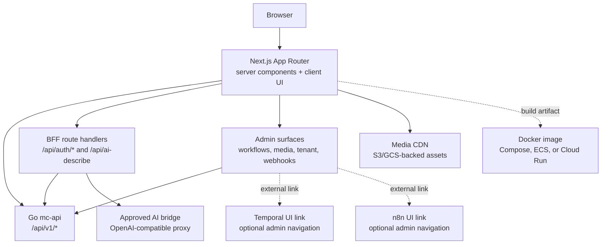

# agentic-ecommerce-web

Public Next.js 15 (App Router) frontend for the
[Agentic Ecommerce](https://github.com/nfsarch33/agentic-ecommerce) Go
backend.

Current release: **v2.0.0**. See `package.json`, `CHANGELOG.md`, and `docs/release-checklist.md` for release gates.

## Architecture



The Go backend (`agentic-ecommerce`) and this frontend are deliberately
split. The frontend is OSS so contributors can build storefront UI
patterns; the backend owns API contracts, business logic, catalog data,
and worker workflows. v2.0.0 adds admin UX for Temporal workflow status,
Media Intelligence, tenant-aware settings, compliance reporting, and n8n
webhook automation while keeping those runtime services owned by the backend
and infra contracts.

## Hard network policy

This app **MUST NOT** call `api.minimaxi.com` or any `*.minimaxi.com`
host directly. AI-routed actions (such as automatic product
descriptions) are proxied through an approved bridge. The bridge URL is
supplied via the `FLEET_AI_BRIDGE_URL` env var, and
[`fleetBridgeUrl`](src/lib/adapters/api/ai-describe.ts) refuses any URL
that:

- targets `api.minimaxi.com` or `*.minimaxi.com`
- targets `localhost` / `127.0.0.1` / `::1`
- is outside the approved bridge allowlist

If `FLEET_AI_BRIDGE_URL` is missing, the BFF returns
`HTTP 503 ai_routing_disabled` rather than silently falling back.

Quota- and rate-limit-aware provider key rotation belongs inside the
approved bridge runtime, not in browser or frontend server code.

## Security headers

Set CSP, referrer policy, frame-ancestor, content-type, and permissions-policy
headers in the deployment platform, CDN, or reverse proxy. Start with the
baseline in `SECURITY.md`, then allow only the deployed storefront origin, the
Go backend origin, approved image/media hosts, and required BFF endpoints.
Frontend role checks are not an authorisation boundary; JWT validation, RBAC,
and rate limiting belong in the Go backend.

## Project layout

```
agentic-ecommerce-web/
├── src/
│   ├── app/                      # Next.js App Router (pages + BFF routes)
│   │   ├── api/ai-describe/      # BFF route for AI-routed describe
│   │   ├── products/             # Storefront product list page
│   │   ├── layout.tsx
│   │   ├── page.tsx
│   │   └── globals.css
│   ├── components/               # Atomic React components
│   ├── lib/
│   │   ├── domain/               # Pure domain entities (Product, Money, ...)
│   │   ├── usecases/             # Application use cases
│   │   └── adapters/api/         # HTTP clients to the Go backend + bridge
│   └── test/                     # Test setup
├── e2e/                          # Playwright end-to-end specs
├── eslint.config.mjs
├── next.config.ts
├── playwright.config.ts
├── postcss.config.mjs            # Tailwind v4
├── tsconfig.json                 # strict + noUncheckedIndexedAccess
├── vitest.config.ts              # 80% coverage thresholds
└── package.json
```

The directory layout follows Clean Architecture:

- **domain**: zero deps, pure functions, entities, value objects
- **usecases**: orchestration, depends on domain + adapter interfaces
- **adapters/api**: HTTP / external-service implementations
- **components / app**: presentation, depends on usecases + domain only

Tests live next to the code they cover (`*.test.ts` / `*.test.tsx`).

## API and BFF Docs

- Backend API source of truth: `agentic-ecommerce/api/openapi.yaml`.
- Generated frontend schema: `src/lib/adapters/api/generated/schema.d.ts`.
- Frontend BFF route documentation: `docs/bff-routes.md`.
- Admin operations documentation: `docs/admin-operations.md`.
- Deployment guide: `docs/deployment.md`.

Regenerate API types after backend OpenAPI changes:

```bash
bun run api:generate
```

## Quality gates

| Gate               | Command                   | Threshold                             |
| ------------------ | ------------------------- | ------------------------------------- |
| TypeScript strict  | `bun run typecheck`       | zero errors                           |
| Unit tests         | `bun run test`            | ≥ 80% lines, branches ≥ 75%           |
| ESLint (next + ts) | `bun run lint`            | zero errors                           |
| Production build   | `bun run build`           | First Load JS < 200 kB enforced       |
| Bundle regression  | `bun run qa:bundle`       | all routes under budget               |
| Playwright smoke   | `bun run test:e2e`        | green on Chromium                     |
| Stable E2E gate    | `bun run test:e2e:stable` | serial Chromium, 2 retries            |
| Lighthouse         | `bun run qa:lighthouse`   | performance and SEO ≥ 90              |
| Security refresh   | `bun run qa:security`     | high/critical gates clean             |
| v2.0.0 release E2E | `make release-e2e`        | checkout + Temporal + MIS + n8n green |

See `docs/v180-frontend-qa.md` for the v1.8.0 Lighthouse, bundle, contract,
E2E stability, and security refresh runbook.

## Local development

Requires:

- [bun](https://bun.sh) ≥ 1.3.0
- a running Go backend at `MC_API_BASE_URL` (default
  `http://localhost:8080`) — see
  [agentic-ecommerce](https://github.com/nfsarch33/agentic-ecommerce)
- an approved bridge URL exported as `FLEET_AI_BRIDGE_URL` if you want
  to exercise the AI describe route. **Never** point this at
  `api.minimaxi.com` or `localhost`.

```bash
bun install
bun run dev
```

The dev server runs on http://localhost:3000 by default.

For a production-style build:

```bash
bun run typecheck
bun run lint
bun run test
bun run build
```

### v2.0.0 release E2E

`make release-e2e` runs the full release flow against the deterministic Bun
mock backend in `e2e/run-with-mock.ts`: product browse, cart, checkout, order
confirmation, admin login, order lookup, mocked AI content workflow completion,
MIS media validation, Temporal publish timeline, mocked WooCommerce publish, a
passing compliance check, and local/mock n8n delivery. It intentionally avoids
live MiniMax, WooCommerce, Slack, SMTP, cloud, and external webhook calls; full
compose coverage remains a separate backend/infra validation step.

### Environment variables

| Var                              | Default                         | Notes                                                                    |
| -------------------------------- | ------------------------------- | ------------------------------------------------------------------------ |
| `MC_API_BASE_URL`                | `http://localhost:8080`         | Server-side Go backend base URL                                          |
| `NEXT_PUBLIC_MC_API_BASE_URL`    | `MC_API_BASE_URL`               | Browser-reachable Go backend base URL                                    |
| `NEXT_PUBLIC_APP_ORIGIN`         | `NEXT_PUBLIC_SITE_URL` fallback | Public storefront origin for metadata, readiness, and deployment headers |
| `NEXT_PUBLIC_MEDIA_CDN_BASE_URL` | _(unset)_                       | Public CDN base URL for media assets                                     |
| `NEXT_PUBLIC_N8N_URL`            | _(unset)_                       | Admin-only n8n UI link                                                   |
| `NEXT_PUBLIC_TEMPORAL_UI_URL`    | _(unset)_                       | Admin-only Temporal UI link                                              |
| `AUTH_COOKIE_SECURE`             | `true` in production            | Secure auth cookie flag                                                  |
| `AUTH_COOKIE_SAME_SITE`          | `lax`                           | Auth cookie SameSite value                                               |
| `AUTH_COOKIE_DOMAIN`             | _(unset)_                       | Optional shared auth cookie domain                                       |
| `FLEET_AI_BRIDGE_URL`            | _(unset)_                       | Approved AI bridge URL (validated)                                       |
| `CSP_CONNECT_SRC`                | _(unset)_                       | Deployment header allowlist for API/BFF/CDN connections                  |
| `CSP_REPORT_URI`                 | _(unset)_                       | Optional CSP report endpoint                                             |
| `PORT`                           | `3000`                          | Next.js dev server port                                                  |

## Contributing

This is a public OSS repo under the Apache-2.0 licence. Pull requests
welcome for storefront UI improvements, accessibility, performance, and
test coverage. Backend / business-logic changes belong in
[`agentic-ecommerce`](https://github.com/nfsarch33/agentic-ecommerce).
