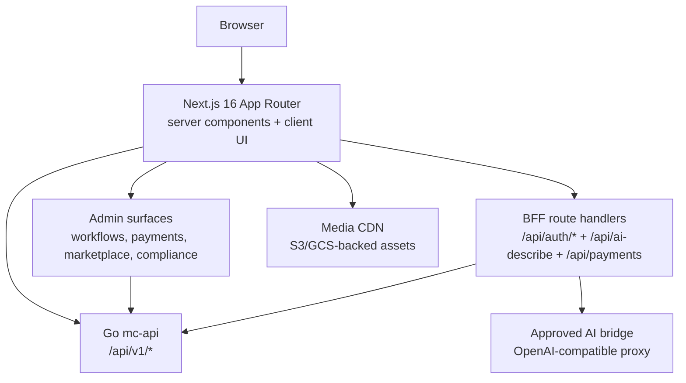

# agentic-ecommerce-web

[](LICENSE)

Public Next.js 16 (App Router) frontend for the
[Agentic Ecommerce](https://github.com/nfsarch33/agentic-ecommerce) Go
backend.

Current release: **v9.0.0**. See `package.json`, `CHANGELOG.md`, and
`docs/release-checklist.md` for release gates. `docs/v10-frontend-release-checklist.md`
and `docs/v10-frontend-release-final.md` stage the post-v9 hardening path.

Release gate note: semver-only tags continue with `v9.0.0` and `v10.0.0`; no
`-rc` variant is releasable evidence for this programme. `v9.0.0` cuts only
after `primary-testing` passes the full primary self-hosted regression,
including stable Playwright, full-stack E2E, cleanup, and UIAuto evidence.

Active v9.x release-gate CI runs on the primary self-hosted testing pool, with
GitHub retained as the canonical repo and PR host. GitLab publishes commit
status back to GitHub and drives the blocking Playwright/local-stack smoke plus
blocking UIAuto evidence on that pool.

Forward contract note: the frontend must consume generated API types and
adapter layers only. Stable backend HTTP/SSE contracts are the source of truth
for agent activity, agent status, sync events, marketplace/media/admin flows,
and AI suggestion paths. Workflow list/detail/review flows must consume the
backend lifecycle payloads directly; if a review signal returns a workflow
snapshot, replace local state with it instead of synthesizing activities or
terminal states in the browser. Workflow review UI stays limited to the
backend-supported `approve` / `reject` contract, and any reviewer/note
evidence returned in workflow detail belongs in the rendered timeline rather
than client-local metadata. Polling and `bff_fallback` remain transitional
until the `v10.0.0` hardening scope closes.

## Pages

| Page | Path | Description |
|------|------|-------------|
| Home | `/` | Landing page with featured products |
| Products | `/products`, `/products/[slug]` | Storefront product browse + detail |
| Cart + Checkout | `/cart`, `/checkout`, `/checkout/success` | Purchase flow |
| Payments | `/payments` | Payment dashboard with transaction history |
| Agent Activity | `/agent-activity` | Real-time SSE feed of agent decisions |
| Margin Dashboard | `/margin-dashboard` | ROI heatmap + dead-stock filter + commission breakdown |
| Operator Alerts | `/admin/observability` | Alert centre with acknowledgment workflow |
| Onboarding | `/register`, `/register/verify`, `/register/onboarding` | 4-step tenant registration wizard |
| Login | `/login` | Authentication |
| Marketplace | `/marketplace`, `/marketplace/[slug]` | Public plugin catalogue |
| Developers | `/developers`, `/developers/api`, `/developers/sdk` | Developer portal |
| Admin | `/admin/*` | Products, orders, agents, memberships, digital goods, marketplace, billing, compliance |

## Tech Stack

| Layer | Technology |
|-------|-----------|
| Framework | Next.js 16.2.6 (App Router, Turbopack) |
| UI | React 19, TypeScript strict (`noUncheckedIndexedAccess`) |
| Styling | Tailwind CSS v4 |
| Testing | Vitest 3.2, Testing Library, Playwright |
| Build | Bun >= 1.3.0 |
| Linting | ESLint 9 + eslint-config-next |
| CI/CD | GitLab CE (self-hosted primary-testing pool), GitHub status bridge |

## Architecture



The Go backend (`agentic-ecommerce`) and this frontend are deliberately
split. The frontend is OSS so contributors can build storefront UI
patterns; the backend owns API contracts, business logic, and worker workflows.

## Getting Started

```bash
bun install
bun run dev
```

The dev server runs on http://localhost:3000 with Turbopack. Point it at
the Go backend via `MC_API_BASE_URL` (default `http://localhost:8080`).

For a production build:

```bash
bun run typecheck
bun run lint
bun run test
bun run build
```

## Quality Gates

| Gate | Command | Threshold |
|------|---------|-----------|
| TypeScript strict | `bun run typecheck` | zero errors |
| Unit tests | `bun run test` | full Vitest suite green, >= 80% lines |
| ESLint | `bun run lint` | zero errors |
| Production build | `bun run build` | First Load JS < 200 kB |
| Bundle regression | `bun run qa:bundle` | all routes under budget |
| Playwright smoke | `bun run test:e2e` | green on Chromium |
| Stable E2E | `bun run test:e2e:stable` | serial Chromium, 56 pass / 2 expected skips |
| Local stack smoke | `bun run test:e2e:local-stack` | primary self-hosted GitLab path |
| Lighthouse | `bun run qa:lighthouse` | performance + SEO >= 90 |

Relevant QA docs:

- `docs/v650-frontend-performance-seo.md`
- `docs/v651-cross-cycle-kpi-dashboard.md`
- `docs/uiauto-playwright-comparison.md`
- `docs/v650-evomap-evoloop.md`
- `docs/v9-frontend-release-final.md`

## Hard Network Policy

This app **MUST NOT** call `api.minimaxi.com` or any `*.minimaxi.com`
host directly. AI-routed actions use the approved bridge via
`FLEET_AI_BRIDGE_URL`. If the bridge URL is missing, the BFF returns
`HTTP 503 ai_routing_disabled`.

## Contributing

This is a public OSS repo under the Apache-2.0 licence. Pull requests
welcome for storefront UI improvements, accessibility, performance, and
test coverage. Backend / business-logic changes belong in
[`agentic-ecommerce`](https://github.com/nfsarch33/agentic-ecommerce).
