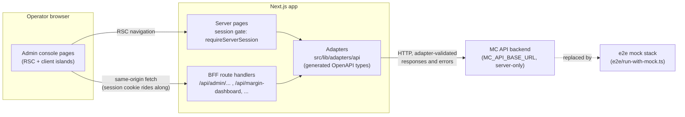

# Architecture

Current structural view of the console. Update this file with the change
when a PR moves a boundary.

## Component flow

## The approvals lane

The approvals inbox is the commercial gate: an operator approves, rejects
(with a required reason), or batch-approves agent-produced product
publishes.

- The page (`/admin/approvals`) is a server component: it gates on the
  session and loads the `waiting_review` queue server-side. No API base
  reaches the browser.
- Decisions POST same-origin to
  `/api/admin/workflows/[id]/signals/review`. That route refuses
  non-JSON bodies (415) and cross-site requests (403) before anything
  upstream runs; it verifies the session from the cookie server-side,
  sets the upstream `reviewer` from that session (a browser-supplied
  reviewer is never trusted), forwards the access bearer and the
  browser's Idempotency-Key, enforces the reason rule for rejects, and
  forwards through the generated-schema adapter
  (`ProductPublishReviewSignal`: `{approved, reviewer?, note?}`).
- The client classifies failures from HTTP status codes only:
  `404/409` → decided elsewhere (refresh, not retry), `5xx`/network →
  retry, other `4xx` → API refusal. A failed decision keeps its buttons
  and its typed reject reason.

## Environment variables

| Variable | Scope | Used by |
|---|---|---|
| `MC_API_BASE_URL` | server-only | Session validation, workflow queue, the approvals BFF route, other BFF proxies. Deliberately has **no default**: unset fails fast as a deployment error. |
| `NEXT_PUBLIC_MC_API_BASE_URL` | browser | Legacy pages that still call the API directly from the client. The approvals lane does **not** read it — new same-origin surfaces must not add consumers. |

The e2e mock stack (`e2e/run-with-mock.ts`) starts the app with
`MC_API_BASE_URL` pointing at its in-process mock API, which also backs
the session and review-signal endpoints.
